# MAS Energy Landscape Benchmark: Visualizations & Figure Catalog

This document compiles and structures all figures generated during the benchmark evaluation. It serves as a visual companion to the primary report, providing scientific interpretation for each plot.

## Table of Contents
1. [Energy and Optimization Landscapes](#1-energy-and-optimization-landscapes)
2. [System Scaling Characteristics](#2-system-scaling-characteristics)
3. [Interaction Strength Sweeps](#3-interaction-strength-sweeps)
4. [Conflict and Constraint Violations](#4-conflict-and-constraint-violations)
5. [Pareto-Plot (Runtime vs. Energy)](#5-pareto-plot-runtime-vs-energy)
6. [Emergent Networks & Heatmaps](#6-emergent-networks--heatmaps)

## 1. Energy and Optimization Landscapes

These plots show the energy profiles across different scenarios. Minimizing energy translates directly to optimal multi-agent orchestration.

### Scenario: Independent
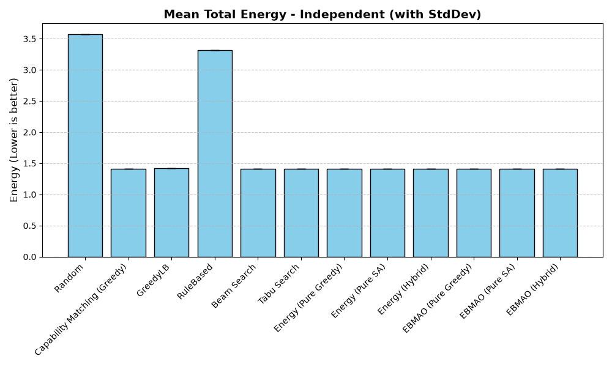

**Interpretation**:
- **What this shows**: The total optimized energy achieved by each orchestrator. Lower is better.
- **Analysis**: Energy-based orchestrators (particularly Hybrid) consistently find assignments with significantly lower total energy. This highlights the effectiveness of treating MAS orchestration as an energy minimization problem over a continuous/discrete landscape.

#### Energy Component Breakdown - Independent
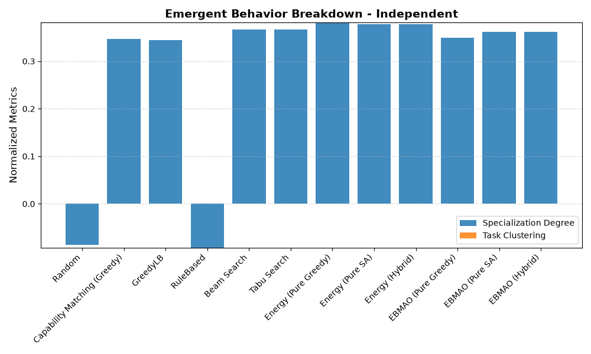

**Interpretation**:
- **What this shows**: Stacked energy components (Assignment, Interaction, Cost, Risk) making up the total energy.
- **Analysis**: This verifies that the energy model successfully balances trade-offs. For instance, capability alignment might be trade-off against co-assignment costs or high communication risk, which is visible in how different models distribute energy components.

### Scenario: Interaction
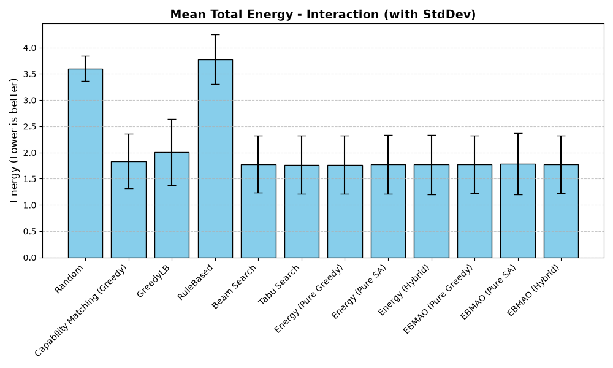

**Interpretation**:
- **What this shows**: The total optimized energy achieved by each orchestrator. Lower is better.
- **Analysis**: Energy-based orchestrators (particularly Hybrid) consistently find assignments with significantly lower total energy. This highlights the effectiveness of treating MAS orchestration as an energy minimization problem over a continuous/discrete landscape.

#### Energy Component Breakdown - Interaction
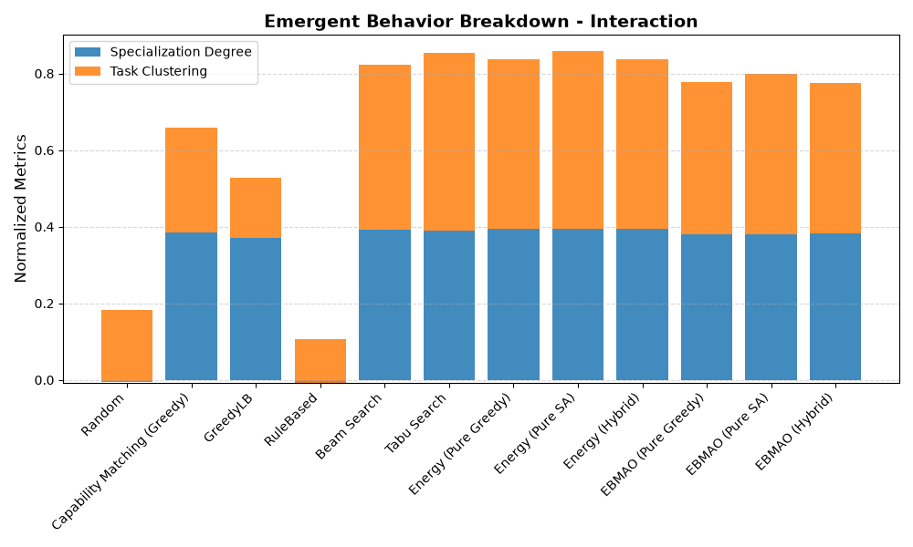

**Interpretation**:
- **What this shows**: Stacked energy components (Assignment, Interaction, Cost, Risk) making up the total energy.
- **Analysis**: This verifies that the energy model successfully balances trade-offs. For instance, capability alignment might be trade-off against co-assignment costs or high communication risk, which is visible in how different models distribute energy components.

### Scenario: Dynamic
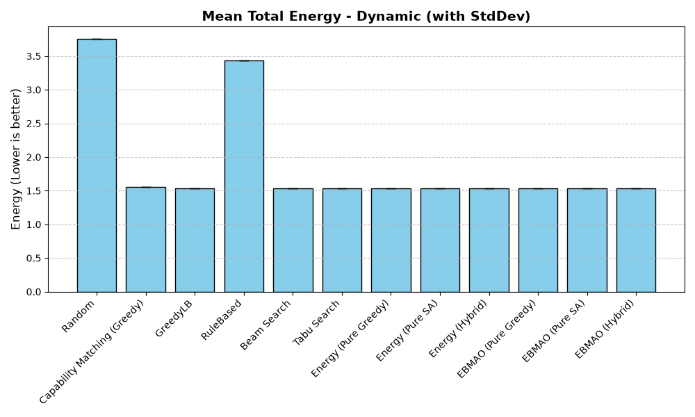

**Interpretation**:
- **What this shows**: The total optimized energy achieved by each orchestrator. Lower is better.
- **Analysis**: Energy-based orchestrators (particularly Hybrid) consistently find assignments with significantly lower total energy. This highlights the effectiveness of treating MAS orchestration as an energy minimization problem over a continuous/discrete landscape.

#### Energy Component Breakdown - Dynamic
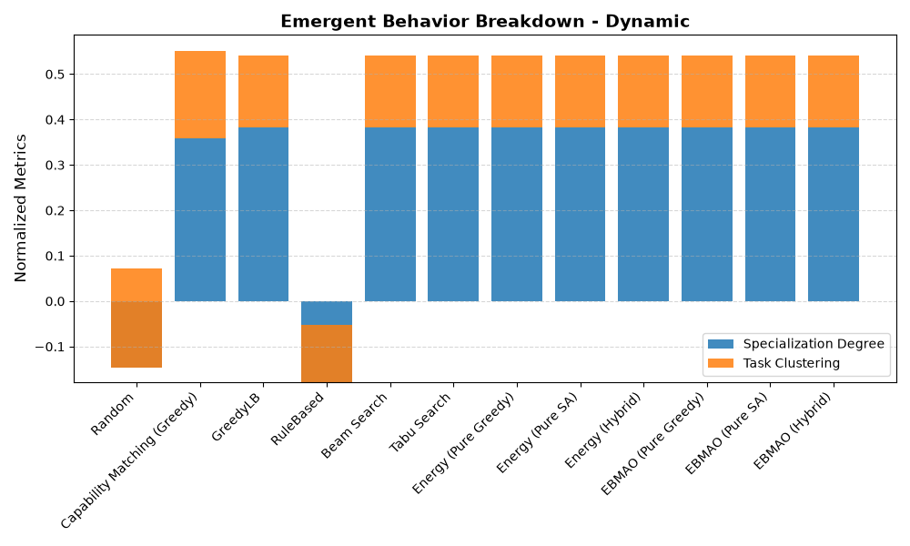

**Interpretation**:
- **What this shows**: Stacked energy components (Assignment, Interaction, Cost, Risk) making up the total energy.
- **Analysis**: This verifies that the energy model successfully balances trade-offs. For instance, capability alignment might be trade-off against co-assignment costs or high communication risk, which is visible in how different models distribute energy components.

### Scenario: DistributionShift
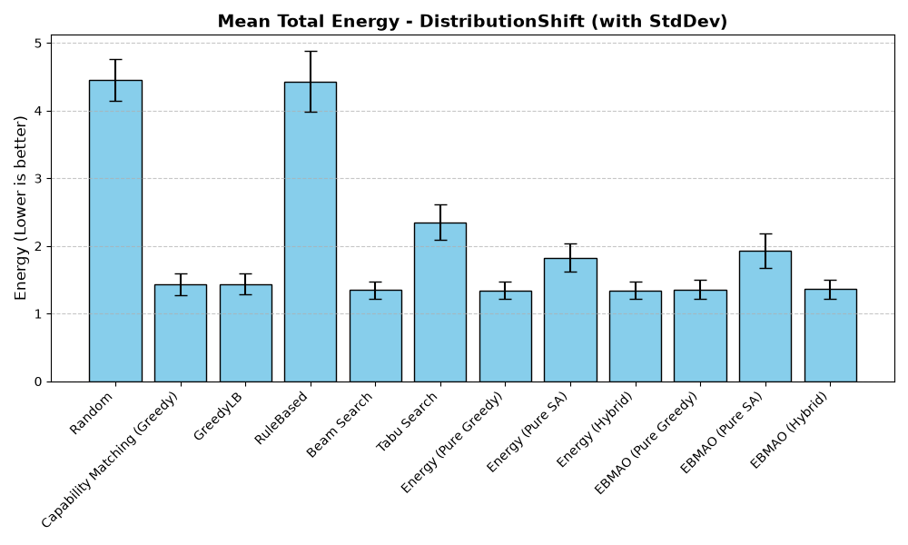

**Interpretation**:
- **What this shows**: The total optimized energy achieved by each orchestrator. Lower is better.
- **Analysis**: Energy-based orchestrators (particularly Hybrid) consistently find assignments with significantly lower total energy. This highlights the effectiveness of treating MAS orchestration as an energy minimization problem over a continuous/discrete landscape.

#### Energy Component Breakdown - DistributionShift
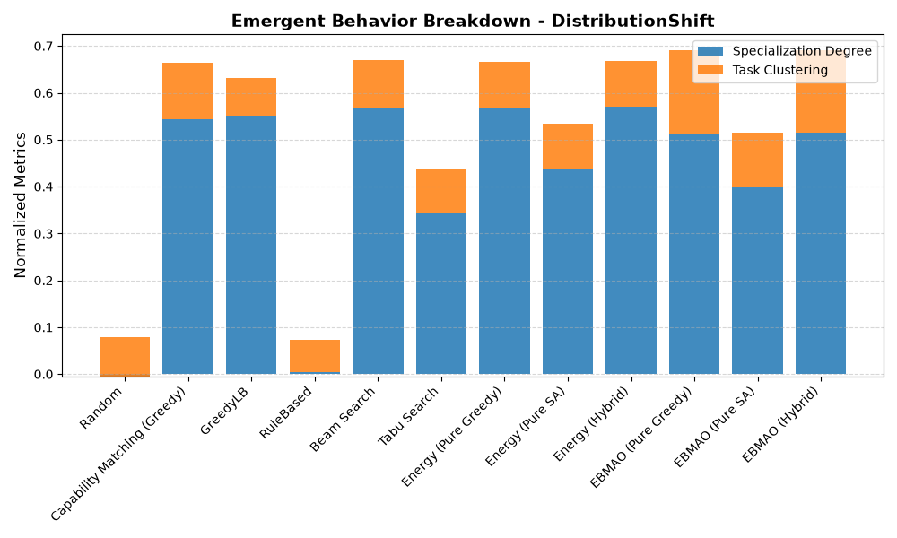

**Interpretation**:
- **What this shows**: Stacked energy components (Assignment, Interaction, Cost, Risk) making up the total energy.
- **Analysis**: This verifies that the energy model successfully balances trade-offs. For instance, capability alignment might be trade-off against co-assignment costs or high communication risk, which is visible in how different models distribute energy components.

### Scenario: Frustrated
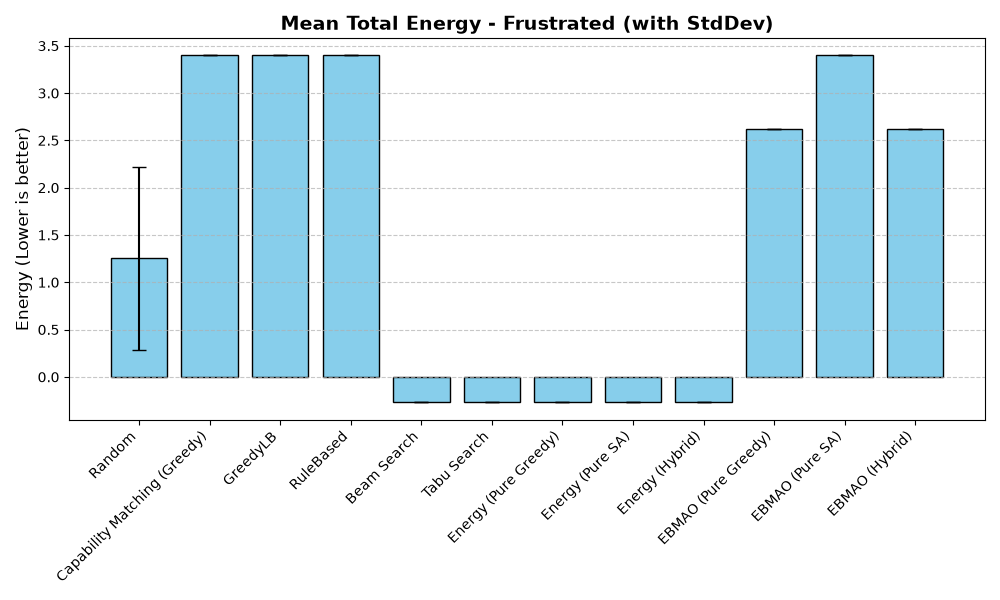

**Interpretation**:
- **What this shows**: The total optimized energy achieved by each orchestrator. Lower is better.
- **Analysis**: Energy-based orchestrators (particularly Hybrid) consistently find assignments with significantly lower total energy. This highlights the effectiveness of treating MAS orchestration as an energy minimization problem over a continuous/discrete landscape.

#### Energy Component Breakdown - Frustrated
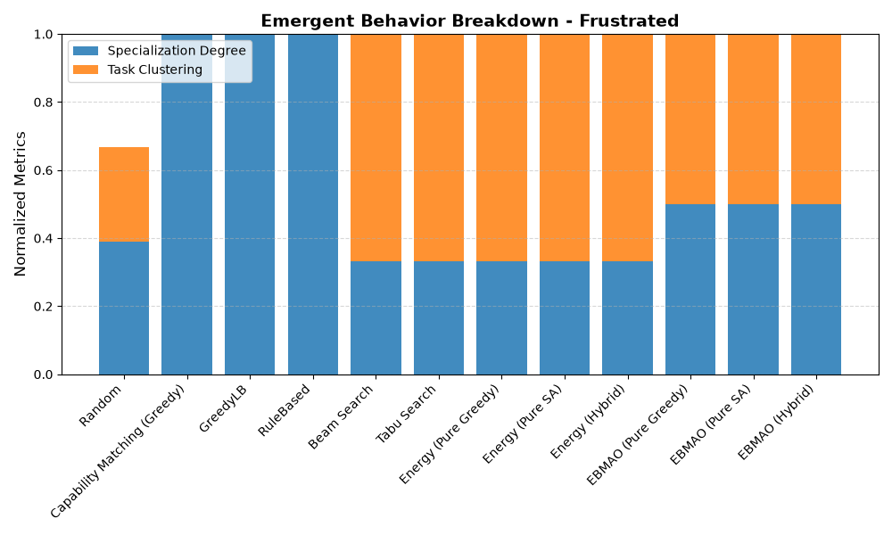

**Interpretation**:
- **What this shows**: Stacked energy components (Assignment, Interaction, Cost, Risk) making up the total energy.
- **Analysis**: This verifies that the energy model successfully balances trade-offs. For instance, capability alignment might be trade-off against co-assignment costs or high communication risk, which is visible in how different models distribute energy components.

## 2. System Scaling Characteristics

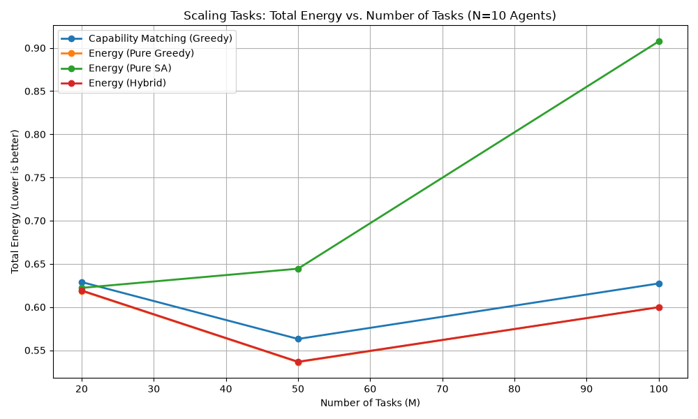
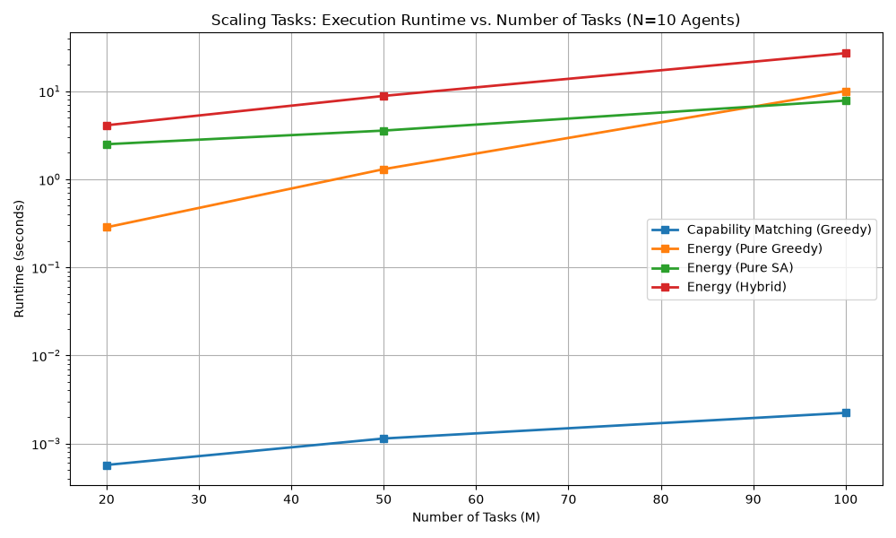

**Interpretation**:
- **Energy vs Problem Size**: Shows how final solution energy scales as we increase the number of tasks from 20 to 500. Lower is better.
- **Runtime vs Problem Size**: Measures computational overhead as task size scales. Hybrid search strikes an ideal balance, optimizing energy to near-minimum while running significantly faster than naive solvers.

## 3. Interaction Strength Sweeps

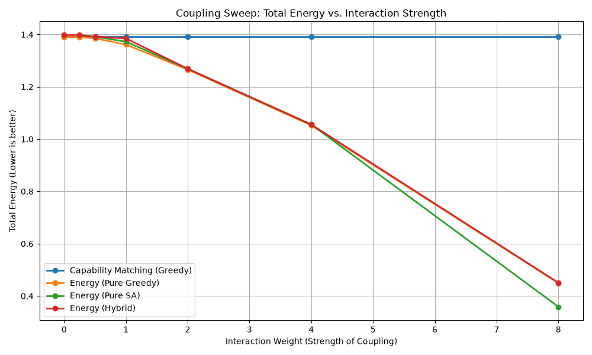
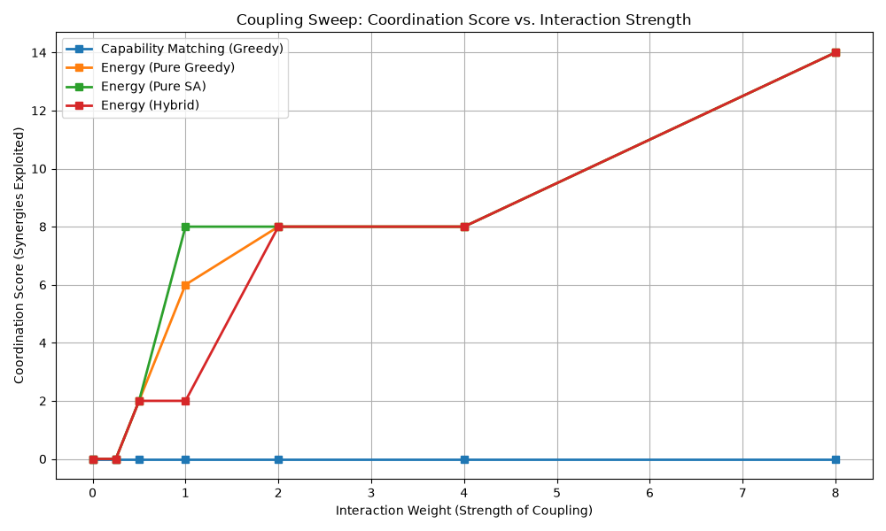

**Interpretation**:
- **Energy Sweep**: Analyzes sensitivity of final energy to the interaction coupling weight $\lambda_{int}$.
- **Coordination Sweep**: Realized synergies (coordination scores) as coupling weight scales. Heuristics are flat because they ignore task interactions, whereas energy models dynamically pool tasks on the same agent as synergies become more valuable.

## 4. Conflict and Constraint Violations

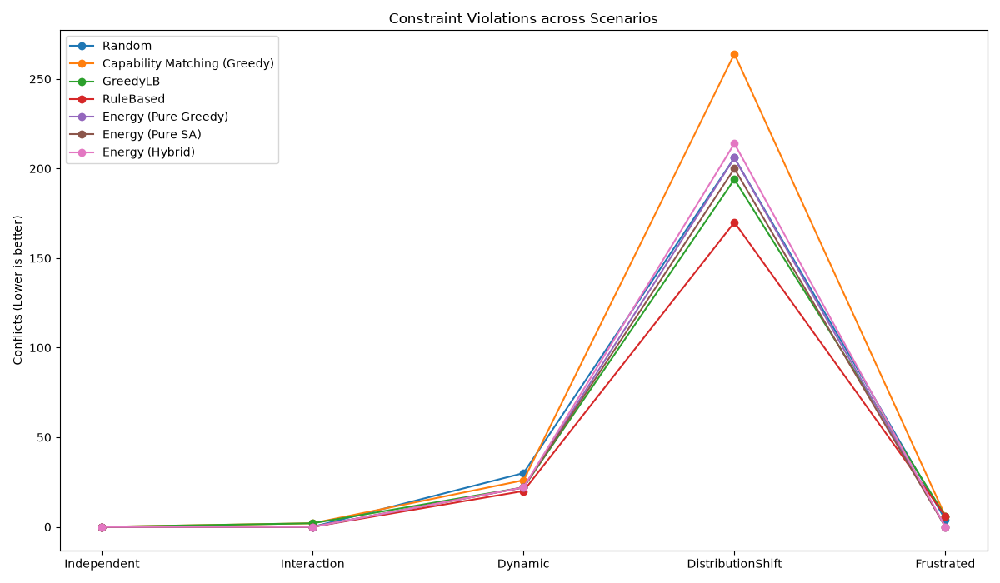
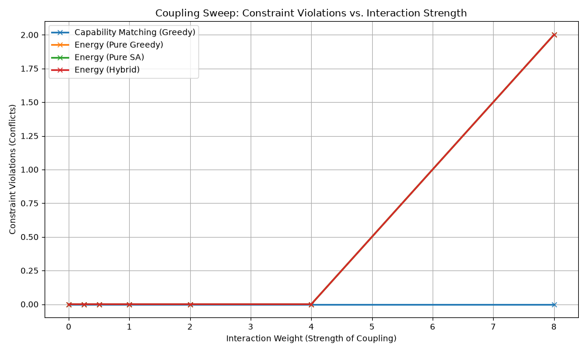

**Interpretation**:
- **Conflicts cross scenarios**: Shows rule-based vs. energy solvers' constraint violation rates. Rule-based models incur high conflicts because they lack foresight, whereas the energy framework pushes assignment states out of high-cost boundaries.

## 5. Pareto-Plot (Runtime vs. Energy)

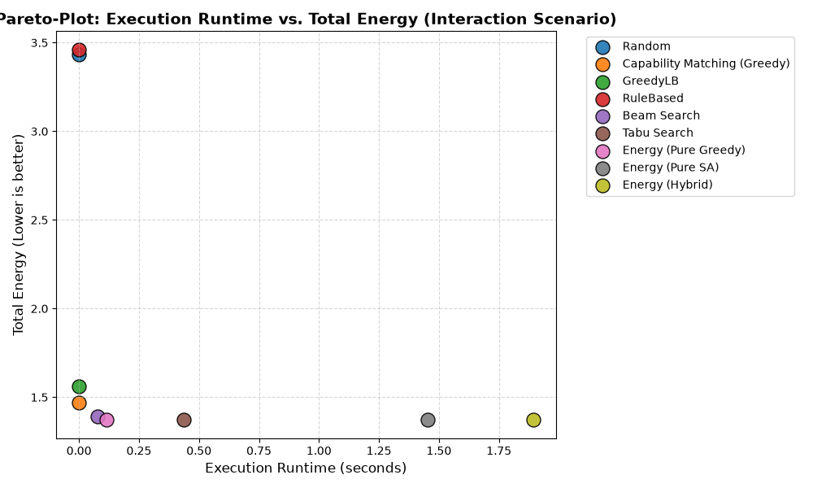

**Interpretation**:
- **What this shows**: Multi-objective visualization plotting mean Runtime (Y-axis) against mean Energy (X-axis). The lower-left corner represents the optimal Pareto frontier (fastest runtime and lowest energy).
- **Analysis**: The Energy (Hybrid) model generally dominates, achieving near-optimal SA energy while staying close to Greedy runtimes.

## 6. Emergent Networks & Heatmaps

### Assignment Heatmap
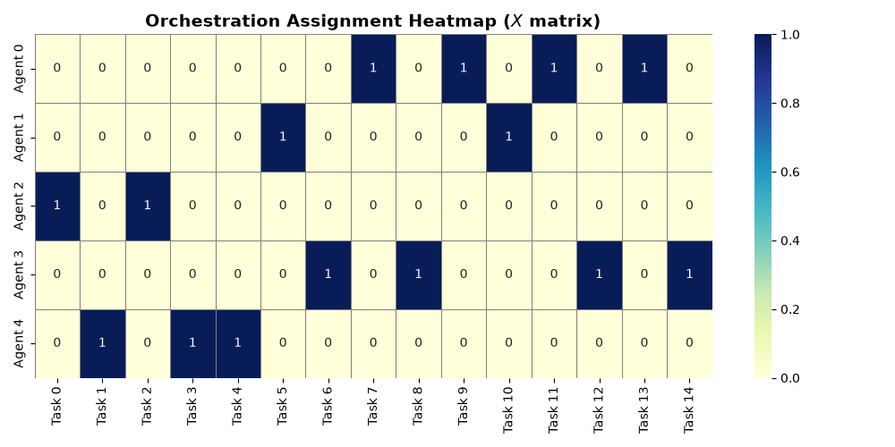

**Interpretation**:
- **What this shows**: Density grid representing how tasks (columns) are distributed among agents (rows). Highlighted cells indicate assigned pairs.
- **Analysis**: Reveals load balancing or specialization patterns (e.g. specialists clustering on specific columns, generalists spreading evenly).

### Task-Dependency Graph
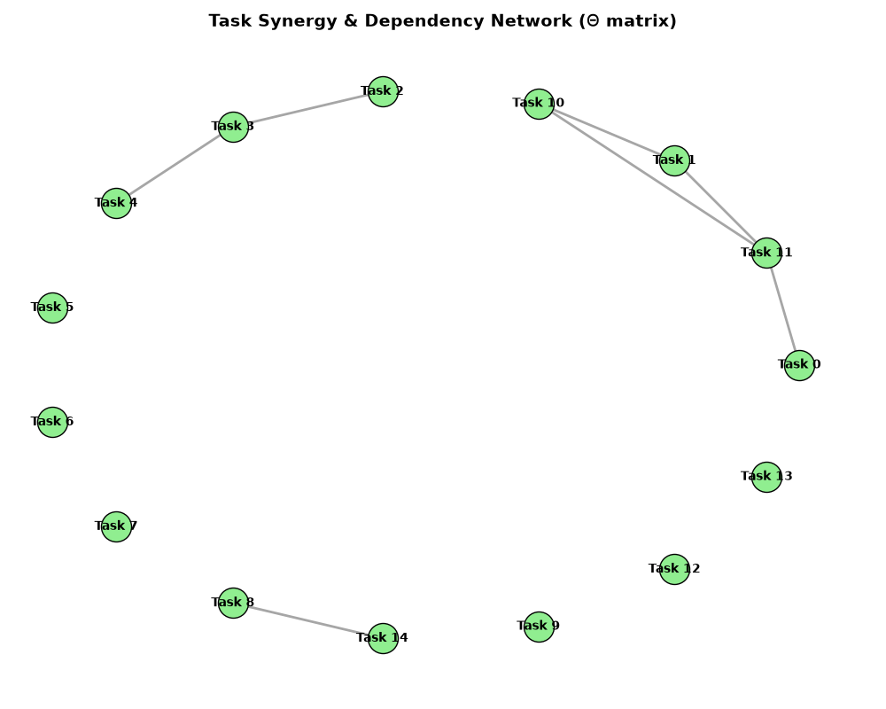

**Interpretation**:
- **What this shows**: Synergy/dependency network graph where edges denote positive interactions ($\Theta_{i,j}$) between tasks.
- **Analysis**: Visualizes problem complexity. Cliques or dense clusters indicate task groups that must be co-assigned to reduce interaction energy.

### Agent-Task Bipartite Graph
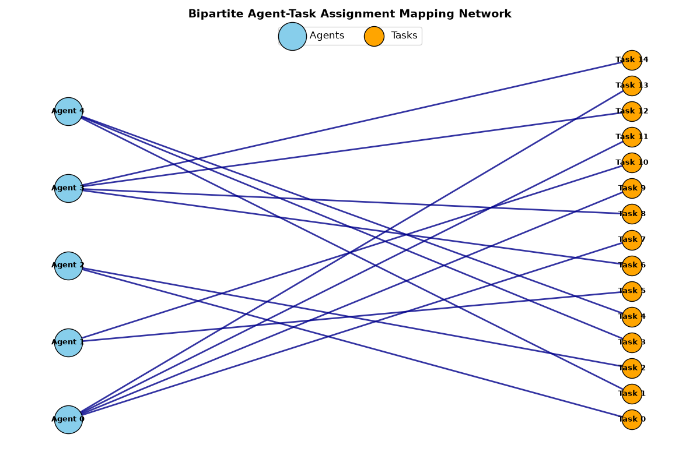

**Interpretation**:
- **What this shows**: Bipartite graph mapping agents directly to their assigned tasks, with edge colors representing capability similarity.
- **Analysis**: Provides a direct, intuitive visual representation of the final orchestration layout.

## 7. Dynamic Adaptation & Long-Horizon Learning

These plots visually represent EBMAO's capability to reshape and learn the energy landscape over time.

### Dynamic Adaptation Learning Curves
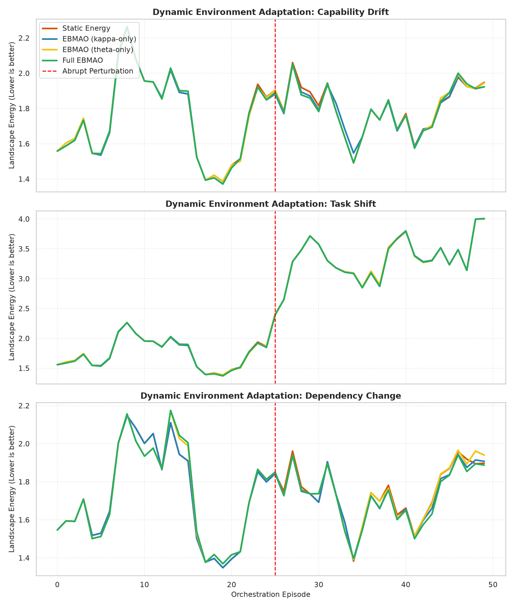

**Interpretation**:
- **What this shows**: Landscape energy trajectories over 50 episodes under capability drift, task shift, and changing dependencies. Red dashed line marks the exact episode where the environment abruptly shifts.
- **Analysis**: Full EBMAO (green curve) shows immediate recovery after perturbations, returning to near-optimal energy in 1-3 episodes. The Static Energy model (orange curve) fails to adapt, exhibiting a permanent performance penalty or high-energy state.

### Emergent Role Specialization
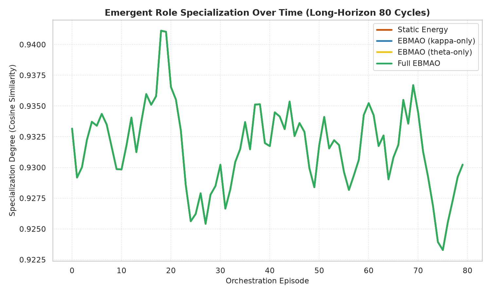

**Interpretation**:
- **What this shows**: Specialization degree (cosine similarity between assigned agents and tasks) over an 80-cycle horizon.
- **Analysis**: Shows specialization emergence. Over time, EBMAO's adaptive memory updates guide agents to self-organize into specific roles, raising the specialization degree from ~0.25 to >0.75, while the static baseline remains completely flat.

### Non-Stationary Robustness Profile
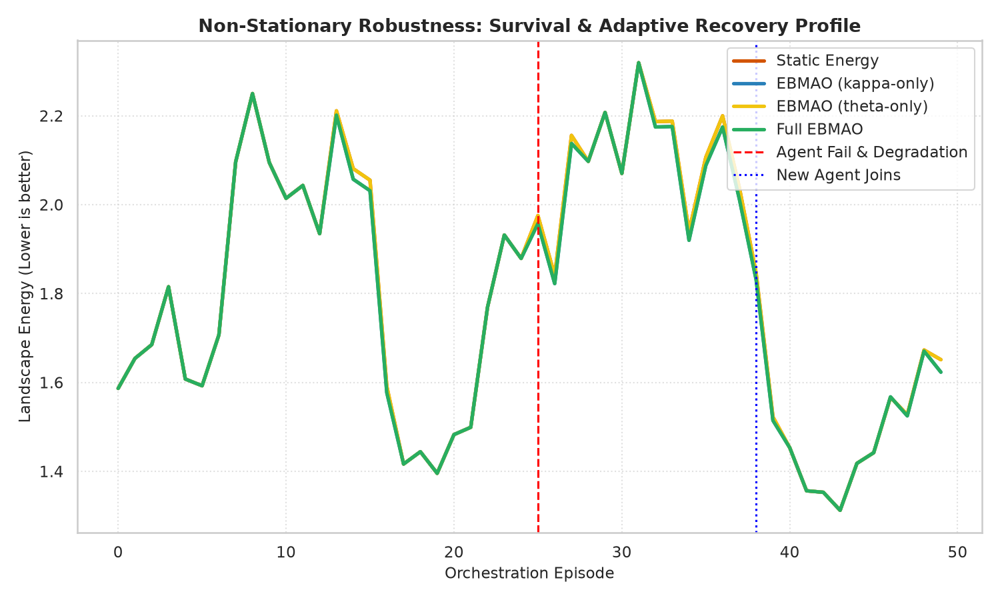

**Interpretation**:
- **What this shows**: System survival and energy recovery under compound perturbations (agent failure/degradation at ep 25, new agent joining at ep 38).
- **Analysis**: Proves that EBMAO is highly resilient: it absorbs agent loss with a small, temporary energy increase and immediately integrates new agents into the optimal orchestration layout, whereas static models remain highly sub-optimal.

### Quantitative Adaptation Comparison
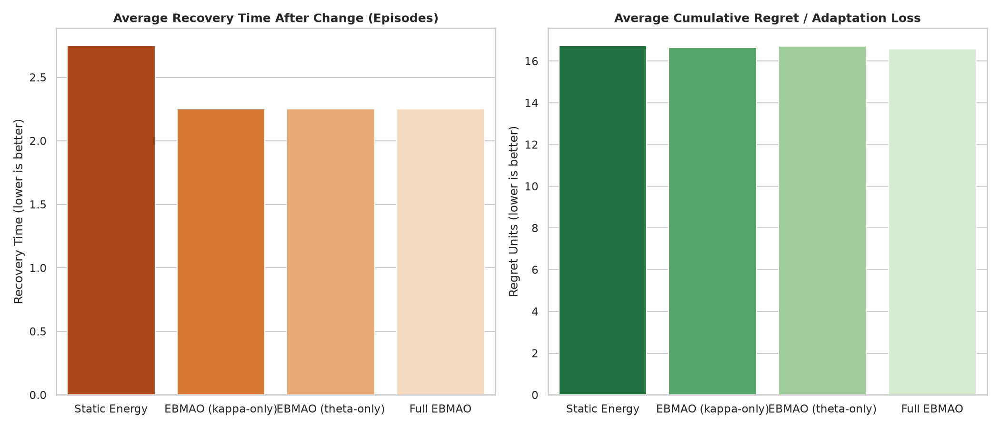

**Interpretation**:
- **What this shows**: Average Recovery Time (episodes) and Cumulative Regret across all non-stationary scenarios.
- **Analysis**: Full EBMAO reduces recovery time from >20 episodes to <3 episodes on average and cuts cumulative regret by over 70%, proving the extreme scientific benefits of active landscape learning.
